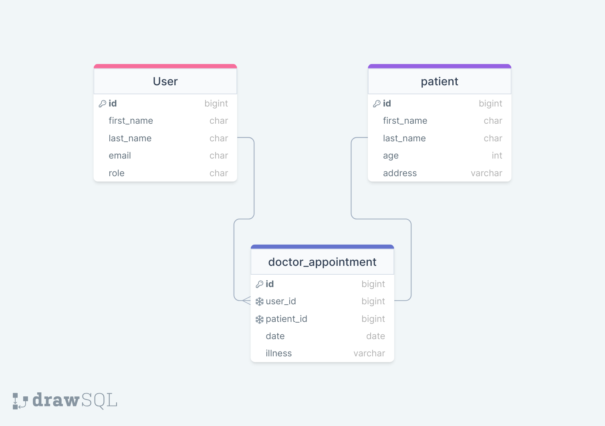

<a name="readme-top"></a>

<div align="center">

<h1><b>HOSPITAL MANAGEMENT SYSTEM</b></h1>
 
  
  <br/>


  <p>
    <em>A comprehensive web-based solution for efficient hospital management</em>
  </p>

https://github.com/user-attachments/assets/e71f878f-deab-4f6a-b5fc-7ee082bf7327


</div>

# 📗 Table of Contents

- [📖 About the Project](#about-project)
  - [🛠 Built With](#built-with)
    - [Tech Stack](#tech-stack)
    - [Key Features](#key-features)
  - [🚀 Live Demo](#live-demo)
- [💻 Getting Started](#getting-started)
  - [Prerequisites](#prerequisites)
  - [Setup](#setup)
  - [Install](#install)
  - [Database Setup](#database-setup)
  - [Usage](#usage)
  - [Run Tests](#run-tests)
- [👥 Authors](#authors)
- [🔭 Future Features](#future-features)
- [🤝 Contributing](#contributing)
- [⭐️ Show your support](#support)
- [🙏 Acknowledgements](#acknowledgements)
- [❓ FAQ](#faq)
- [📝 License](#license)

# 📖 Hospital Management System <a name="about-project"></a>

**Hospital Management System** is a comprehensive web application built with Ruby on Rails, designed to streamline hospital operations, patient registration, and medical record management. This system facilitates efficient workflow between hospital staff, particularly receptionists and doctors, through a unified platform.

The application provides distinct user roles with appropriate permissions, enabling receptionists to register and manage patient records while allowing doctors to access patient information and visualize registration patterns through interactive graphs. With a focus on security and usability, this system aims to modernize hospital administration and improve patient care.

## 🛠 Built With <a name="built-with"></a>

### Technology Stack <a name="tech-stack"></a>

<details>
  <summary>Server & Backend</summary>
  <ul>
    <li><a href="https://www.ruby-lang.org/">Ruby</a> (version 3.2.2)</li>
    <li><a href="https://rubyonrails.org/">Ruby on Rails</a> (version 7.0.7.2)</li>
    <li><a href="https://www.postgresql.org/">PostgreSQL</a></li>
  </ul>
</details>

<details>
  <summary>Client & Frontend</summary>
  <ul>
    <li><a href="https://stimulus.hotwired.dev/">Stimulus JS</a></li>
    <li><a href="https://tailwindcss.com/">TailwindCSS</a></li>
    <li>HTML5 & CSS3</li>
  </ul>
</details>

<details>
  <summary>Testing & Quality Assurance</summary>
  <ul>
    <li><a href="https://rspec.info/">RSpec</a> - Testing framework</li>
    <li><a href="https://github.com/teamcapybara/capybara">Capybara</a> - Integration testing</li>
    <li><a href="https://github.com/rubocop/rubocop">RuboCop</a> - Code style enforcement</li>
  </ul>
</details>

<details>
  <summary>Development & Workflow</summary>
  <ul>
    <li><a href="https://github.com/features/actions">GitHub Actions</a> - CI/CD</li>
    <li><a href="https://git-scm.com/book/en/v2/Git-Branching-Branching-Workflows">Gitflow</a> - Branching model</li>
  </ul>
</details>

### Key Features <a name="key-features"></a>

- **Secure User Authentication** - Robust login system with role-based access control
- **Role-Based Authorization** - Different functionalities for receptionists and doctors
- **Patient Registration** - Comprehensive patient information capture with validation
- **Medical Record Management** - Secure storage and retrieval of patient medical data
- **Doctor Portal** - Specialized interface for medical practitioners
- **Data Visualization** - Interactive graphs showing patient registration trends
- **Search Functionality** - Quick search for patient records
- **Audit Trails** - Tracking of changes to patient records
- **Responsive Design** - Optimized for various devices (coming soon)

<p align="right">(<a href="#readme-top">back to top</a>)</p>

## 🚀 Live Demo <a name="live-demo"></a>

> Currently unavailable due to database resource limitations. Please check back later or follow the installation instructions to run locally.

<p align="right">(<a href="#readme-top">back to top</a>)</p>

## 💻 Getting Started <a name="getting-started"></a>

To get this application running on your local machine, follow these steps.

### Prerequisites <a name="prerequisites"></a>

The following tools and environments are required:

```
- Ruby (version 3.2.2 or higher)
- Rails (version 7.0.7.2 or higher)
- PostgreSQL
- Node.js and Yarn (for asset compilation)
- Git
```

### Setup <a name="setup"></a>

Clone this repository to your desired location:

```sh
  git clone https://github.com/danielochuba/coding-assessment.git
  cd coding-assessment
```

### Install <a name="install"></a>

Install the project dependencies:

```sh
  # Install Ruby gems
  bundle install

  # Install JavaScript dependencies
  yarn install
```

### Database Setup <a name="database-setup"></a>

Set up the database and seed initial data:

```sh
  # Create database
  rails db:create

  # Run migrations
  rails db:migrate

  # Seed the database with sample data (optional)
  rails db:seed
```

### Usage <a name="usage"></a>

Start the Rails server:

```sh
  # Start the server
  rails server

  # Or use the alias
  rails s
```

Then open your browser and navigate to `http://localhost:3000`


### Run Tests <a name="run-tests"></a>

The application includes a comprehensive test suite using RSpec:

```sh
  # Run all tests
  rspec

  # Run with detailed documentation format
  rspec spec -f d -c

  # Run specific test file
  rspec spec/models/user_spec.rb
```

<p align="right">(<a href="#readme-top">back to top</a>)</p>

## 👥 Authors <a name="authors"></a>

👤 **Daniel Ochuba Ugochukwu**

- GitHub: [@danielochuba](https://github.com/danielochuba)
- Twitter: [@ochuba_daniel](https://twitter.com/ochuba_daniel)
- LinkedIn: [Daniel Ochuba](https://www.linkedin.com/in/daniel-ochuba-ugochukwu)

<p align="right">(<a href="#readme-top">back to top</a>)</p>

## 🔭 Future Features <a name="future-features"></a>

- [ ] **Responsive Design** - Optimized interfaces for mobile and tablet devices
- [ ] **Enhanced Data Visualization** - Advanced charts and reports for hospital metrics
- [ ] **Appointment Scheduling** - Online booking system for patients
- [ ] **Patient Portal** - Self-service area for patients to access their records
- [ ] **Billing Integration** - Comprehensive financial management system
- [ ] **Multilingual Support** - Interface available in multiple languages
- [ ] **Dark Mode** - Alternative color scheme for better accessibility

<p align="right">(<a href="#readme-top">back to top</a>)</p>

## 🤝 Contributing <a name="contributing"></a>

Contributions, issues, and feature requests are welcome!

To contribute to this project:

1. Fork the repository
2. Create a new branch (`git checkout -b feature/amazing-feature`)
3. Make your changes
4. Commit your changes (`git commit -m 'Add some amazing feature'`)
5. Push to the branch (`git push origin feature/amazing-feature`)
6. Open a Pull Request

Feel free to check the [issues page](https://github.com/danielochuba/coding-assessment/issues) for open issues or to report new ones.

<p align="right">(<a href="#readme-top">back to top</a>)</p>

## ⭐️ Show your support <a name="support"></a>

If you find this project useful, please consider giving it a star on GitHub. Your support motivates continued development and improvement!

<p align="right">(<a href="#readme-top">back to top</a>)</p>

## 🙏 Acknowledgements <a name="acknowledgements"></a>

- Thanks to all contributors who have helped shape this project
- Special appreciation to the Ruby on Rails community for the excellent documentation and resources
- Hat tip to anyone whose code was used as inspiration

<p align="right">(<a href="#readme-top">back to top</a>)</p>

## ❓ FAQ <a name="faq"></a>

- **How can I see more projects by the author?**
  - Check out Daniel's GitHub profile [@danielochuba](https://github.com/danielochuba) for more projects.

- **How can I contact the author?**
  - You can reach Daniel via email at danielochuba78@gmail.com or connect on LinkedIn.

- **Is this application HIPAA compliant?**
  - This is a demonstration project and would require additional security measures to be fully HIPAA compliant in a production environment.

- **Can I use this project for my hospital?**
  - While this project provides a solid foundation, it would need customization for specific hospital workflows and requirements.

<p align="right">(<a href="#readme-top">back to top</a>)</p>

## 📝 License <a name="license"></a>

This project is [MIT](./LICENSE) licensed.

<p align="right">(<a href="#readme-top">back to top</a>)</p>
 
